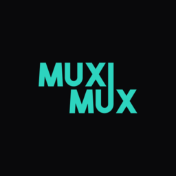
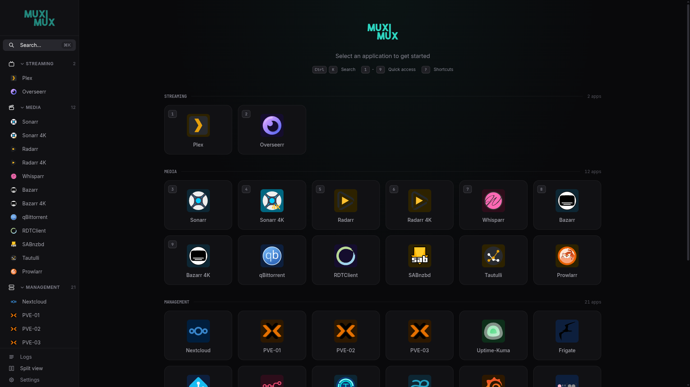
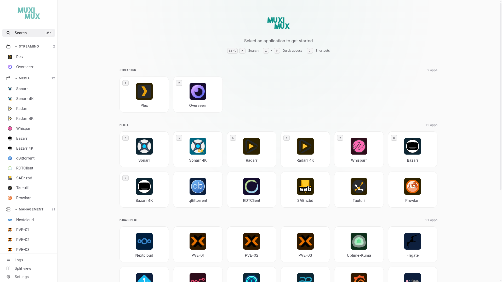
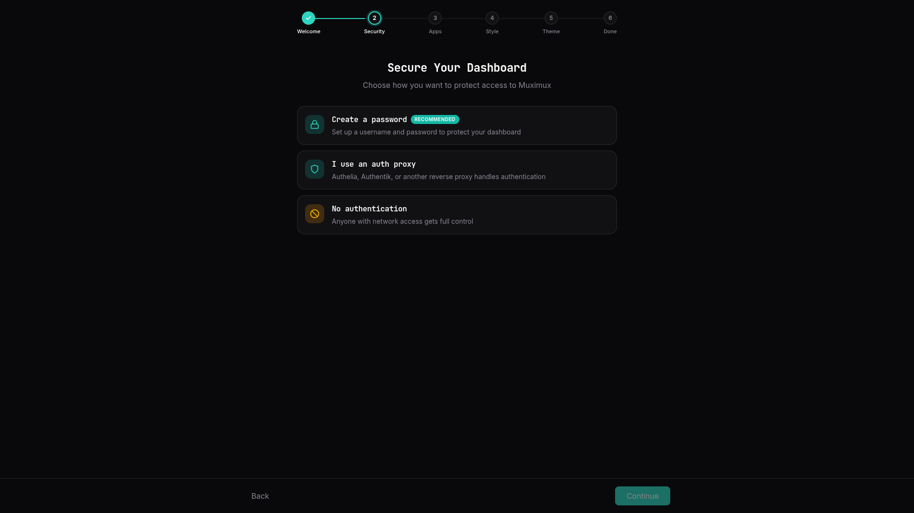
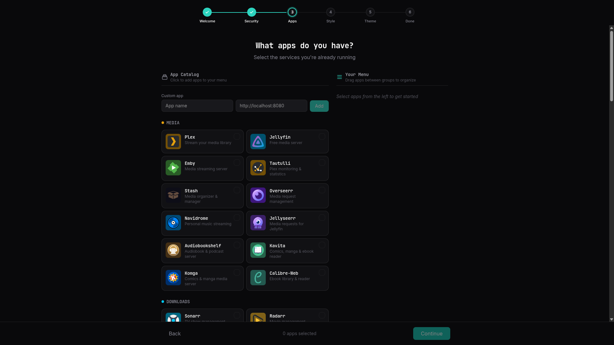
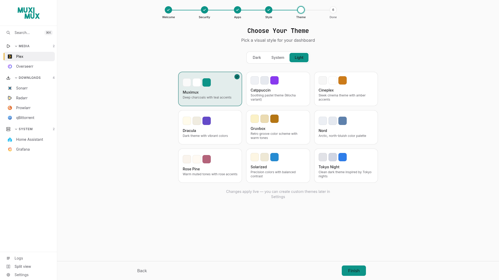
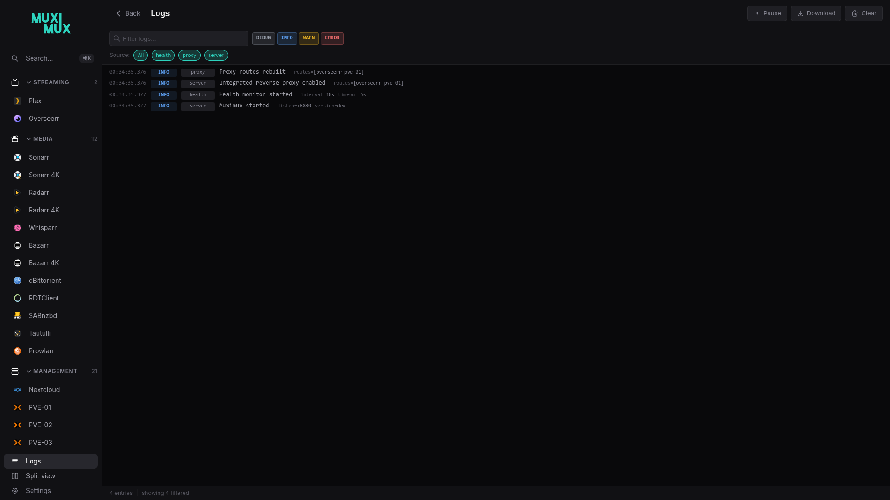
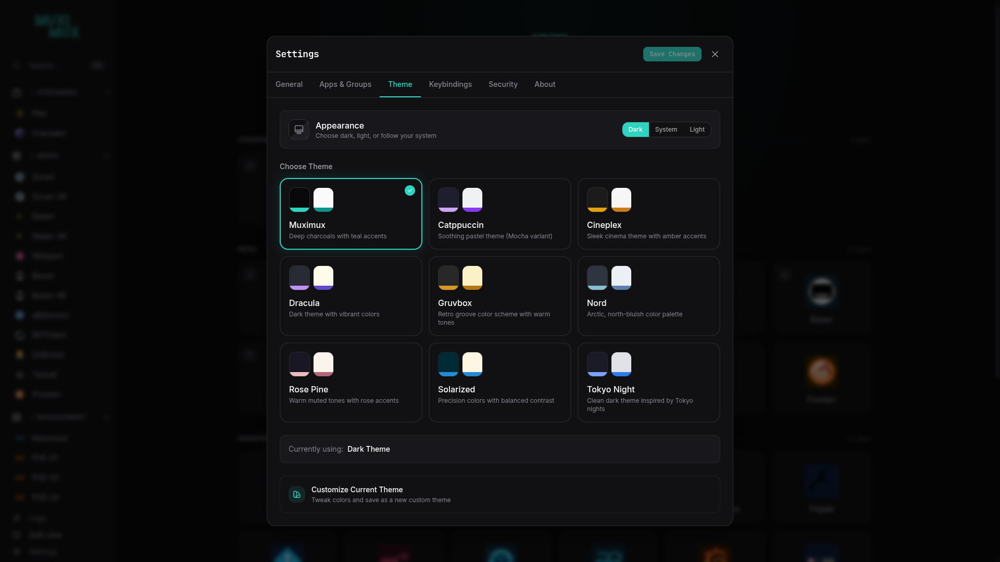
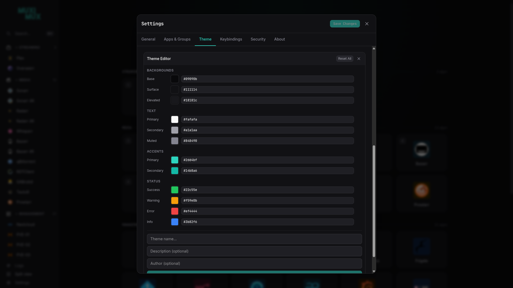

<p align="center">
  
</p>

# Muximux

A self-hosted homelab dashboard with an optional built-in reverse proxy that makes stubborn apps work in iframes.

One binary. One port. One YAML config file.

[](https://github.com/mescon/Muximux/actions/workflows/ci.yml)
[](https://github.com/mescon/Muximux/actions/workflows/codeql.yml)
[](https://goreportcard.com/report/github.com/mescon/muximux/v3)
[](https://sonarcloud.io/summary/new_code?id=mescon_Muximux)
[](https://codecov.io/gh/mescon/Muximux)
[](https://ghcr.io/mescon/muximux)




<details>
<summary><strong>More screenshots</strong> — onboarding wizard, light mode, themes</summary>
<br>
<table>
<tr>
<td align="center"><a href="docs/screenshots/10-dashboard-light.png"></a><br><sub>Dashboard (Light)</sub></td>
<td align="center"><a href="docs/screenshots/01-welcome.png"></a><br><sub>Onboarding — Welcome</sub></td>
<td align="center"><a href="docs/screenshots/02-security.png"></a><br><sub>Onboarding — Security</sub></td>
</tr>
<tr>
<td align="center"><a href="docs/screenshots/03-apps-catalog.png"></a><br><sub>Onboarding — App Catalog</sub></td>
<td align="center"><a href="docs/screenshots/04-apps-selected.png"></a><br><sub>Onboarding — Apps Configured</sub></td>
<td align="center"><a href="docs/screenshots/05-style.png"></a><br><sub>Onboarding — Style</sub></td>
</tr>
<tr>
<td align="center"><a href="docs/screenshots/06-theme-dark.png"></a><br><sub>Onboarding — Themes (Dark)</sub></td>
<td align="center"><a href="docs/screenshots/07-theme-light.png"></a><br><sub>Onboarding — Themes (Light)</sub></td>
<td align="center"><a href="docs/screenshots/08-done.png"></a><br><sub>Onboarding — Done</sub></td>
</tr>
<tr>
<td align="center"><a href="docs/screenshots/13-logs.png"></a><br><sub>Real-Time Log Viewer</sub></td>
<td align="center"><a href="docs/screenshots/11-themes.png"></a><br><sub>Theme Selector</sub></td>
<td align="center"><a href="docs/screenshots/12-theme-customizer.png"></a><br><sub>Theme Customizer</sub></td>
</tr>
</table>
</details>

---

## What Is Muximux?

If you run services like Sonarr, Radarr, Plex, Grafana, or Home Assistant in your homelab, you probably have a dozen browser bookmarks and port numbers to remember. Muximux gives you a single page where all of those apps live, organized into groups, with live health indicators showing what's up and what's down.

Apps load inside the dashboard as iframes, so switching between them is instant - no page reloads, no losing your place. For apps that refuse to be embedded (most set `X-Frame-Options: DENY`), Muximux includes a reverse proxy that transparently strips those headers and rewrites paths so they work.

Everything is configured in one YAML file — no database, no external dependencies. The entire application ships as a single binary with the frontend embedded. Every setting is configurable through the built-in GUI, so you never have to touch the YAML directly. Back up or migrate your entire setup by copying a single file.

---

## Why v3?

Muximux v3 is a ground-up rewrite. The original [Muximux](https://github.com/mescon/Muximux/tree/v2.0) was a PHP application that served as a simple bookmark portal. v3 replaces it with a modern stack and a much broader feature set:

- **Go backend** with the frontend embedded in the binary - no PHP, no web server, no runtime dependencies
- **Built-in reverse proxy** that rewrites HTML, CSS, JS, and headers so apps actually work inside iframes
- **Real-time health monitoring** via WebSocket - see which apps are up or down without refreshing
- **Built-in authentication** - username/password, forward auth (Authelia/Authentik), or OIDC
- **Optional TLS and gateway** - an embedded Caddy instance can handle HTTPS certificates and serve other sites alongside Muximux
- **Guided onboarding** - a setup wizard walks you through security setup and adding your first apps
- **1,600+ icons** from Lucide plus thousands of service-specific icons from [Dashboard Icons](https://github.com/homarr-labs/dashboard-icons)
- **Keyboard shortcuts** for power users - switch apps, toggle navigation, search, all from the keyboard
- **Themes** - built-in light and dark modes, plus custom themes via CSS

---

## How You Can Use It

Muximux fits different setups. Pick the level that matches yours.

### Dashboard behind your existing proxy

You already have Traefik, nginx, or Caddy handling TLS and auth. Run Muximux behind it with `auth: none` and let your proxy do the heavy lifting. Muximux serves on a single port and your proxy forwards to it. This is the simplest setup.

### Dashboard with the built-in reverse proxy

Same as above, but some of your apps refuse to load in iframes. Set `proxy: true` on those apps and Muximux will proxy them through `/proxy/{slug}/`, stripping blocking headers and rewriting paths. This runs inside the Go server and works in every deployment mode - no extra configuration needed.

### Full reverse proxy appliance

No existing proxy? Use Muximux as your only reverse proxy. Configure `tls.domain` for automatic HTTPS via Let's Encrypt and a `gateway` Caddyfile to serve your other services on their own domains. Caddy handles TLS certificates, HTTP-to-HTTPS redirects, and routing - all from the same single binary.

See the [Deployment Guide](docs/wiki/deployment.md) for Docker Compose examples for each setup.

---

## Quick Start

### Docker

```bash
docker run -d \
  --name muximux \
  -p 8080:8080 \
  -v $(pwd)/data:/app/data \
  ghcr.io/mescon/muximux:latest
```

Open `http://localhost:8080`. If no config file exists, an onboarding wizard will guide you through security and initial setup.

### Docker Compose

```yaml
services:
  muximux:
    image: ghcr.io/mescon/muximux:latest
    ports:
      - "8080:8080"
    volumes:
      - ./data:/app/data
    restart: unless-stopped
```

### Binary

```bash
./muximux
```

By default, Muximux uses `data/` beside the binary as its data directory (containing config, themes, icons). Override it with `--data` or the `MUXIMUX_DATA` environment variable.

See [docker-compose.yml](docker-compose.yml) for a full example with environment variables, health checks, and optional TLS/gateway ports.

---

## Documentation

Full documentation is available in the **[Wiki](docs/wiki/README.md)**:

- [Installation](docs/wiki/installation.md) - Docker, binary, building from source
- [Getting Started](docs/wiki/getting-started.md) - First launch and onboarding
- [Configuration Reference](docs/wiki/configuration.md) - All config.yaml options
- [Apps](docs/wiki/apps.md) - Adding and configuring applications
- [Built-in Reverse Proxy](docs/wiki/reverse-proxy.md) - How the proxy works and when to use it
- [Authentication](docs/wiki/authentication.md) - Auth methods and setup
- [TLS & HTTPS](docs/wiki/tls-and-gateway.md) - Certificates and gateway mode
- [Deployment Guide](docs/wiki/deployment.md) - Production deployment examples
- [Themes](docs/wiki/themes.md) - Customizing the look
- [API Reference](docs/wiki/api.md) - REST API endpoints

---

## Configuration at a Glance

Everything lives in one YAML file. Here's the essentials:

```yaml
server:
  listen: ":8080"
  title: "My Homelab"

apps:
  - name: Sonarr
    url: http://sonarr:8989
    icon: { type: dashboard, name: sonarr }
    group: Media
    proxy: true            # Proxy through /proxy/sonarr/
    open_mode: iframe      # iframe, new_tab, new_window, redirect

  - name: Grafana
    url: http://grafana:3000
    icon: { type: dashboard, name: grafana }
    group: Monitoring

groups:
  - name: Media
    icon: { type: lucide, name: play }
    color: "#e5a00d"

  - name: Monitoring
    icon: { type: lucide, name: activity }
    color: "#27ae60"
```

Configuration values can reference environment variables (`${OIDC_CLIENT_SECRET}`), and the listen address can be overridden via `--listen` flag or `MUXIMUX_LISTEN` env var. The data directory (where config, themes, and icons live) defaults to `data/` beside the binary and can be set via `--data` or `MUXIMUX_DATA`.

For the full configuration reference, authentication options, TLS setup, and more, see the **[Wiki](docs/wiki/README.md)**.

---

## Features

| | |
|---|---|
| **Reverse Proxy** | Strips iframe-blocking headers, rewrites HTML/CSS/JS paths, handles gzip - makes apps work in iframes that normally refuse. Per-app TLS settings, custom headers, and configurable timeout |
| **Health Monitoring** | Periodic health checks with real-time WebSocket updates and colored status indicators |
| **Real-Time Log Viewer** | In-app log viewer with level/source filtering, search, auto-scroll, pause/resume, and download. Debug level exposes detailed request tracing |
| **Authentication** | Built-in users (bcrypt), forward auth (Authelia/Authentik), or OIDC - with user management and roles |
| **TLS / HTTPS** | Automatic Let's Encrypt certificates or manual cert/key, powered by embedded Caddy |
| **Gateway** | Reverse proxy other sites and services on your network -- things that don't need to be in the Muximux menu -- via a standard Caddyfile |
| **Navigation** | 5 positions (top, left, right, bottom, floating), auto-hide, customizable width |
| **Icons** | 1,600+ Lucide icons, thousands of Dashboard Icons, URL icons, custom uploads |
| **Keyboard Shortcuts** | Configurable keybindings for switching apps, toggling navigation, search |
| **Themes** | 9 built-in theme families (Default, Nord, Dracula, Catppuccin, Solarized, Tokyo Night, Gruvbox, Cineplex, Rose Pine) with dark/light variants, plus custom themes via CSS |
| **Config Export/Import** | Export config as YAML, import to preview and apply - sensitive data stripped on export |
| **Environment Variables** | `${VAR}` expansion in config.yaml, `MUXIMUX_DATA`, `MUXIMUX_LISTEN`, and `MUXIMUX_CONFIG` overrides |
| **REST API** | Full CRUD for apps, groups, config, health, and auth |
| **Single Binary** | Frontend embedded in the Go binary - one file to deploy, no runtime dependencies |
| **Portable** | No database - one YAML config file stores everything. Every setting is editable in the GUI. Copy one file to back up or migrate |

---

## Development

```bash
git clone https://github.com/mescon/Muximux.git
cd Muximux

# Enable git hooks (pre-push runs tests with coverage checks)
git config core.hooksPath .githooks

# Frontend dev server (hot reload)
cd web && npm install && npm run dev &

# Backend (uses data/ beside the binary by default for config, themes, icons)
go run ./cmd/muximux
```

### Building

```bash
# Build frontend (outputs to internal/server/dist/)
cd web && npm run build && cd ..

# Build binary (embeds frontend)
go build -tags embed_web -o muximux ./cmd/muximux

# With version info
go build -tags embed_web -ldflags "-X main.version=3.0.0" -o muximux ./cmd/muximux
```

---

## License

GPL v2 - see [LICENSE](LICENSE) for details.

## Credits

- [Lucide Icons](https://lucide.dev/) for the icon library
- [Dashboard Icons](https://github.com/homarr-labs/dashboard-icons) by Homarr Labs
- [Caddy](https://caddyserver.com/) for embedded TLS and gateway support
