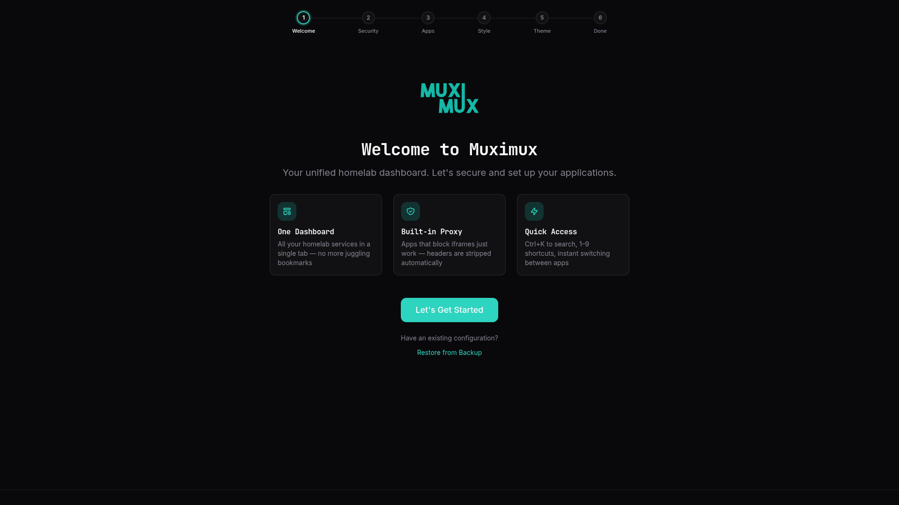
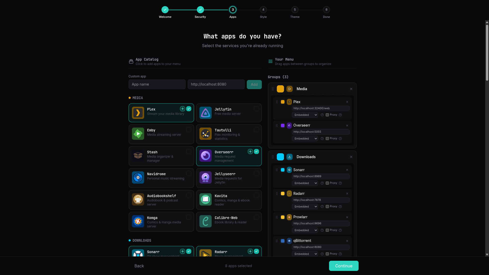
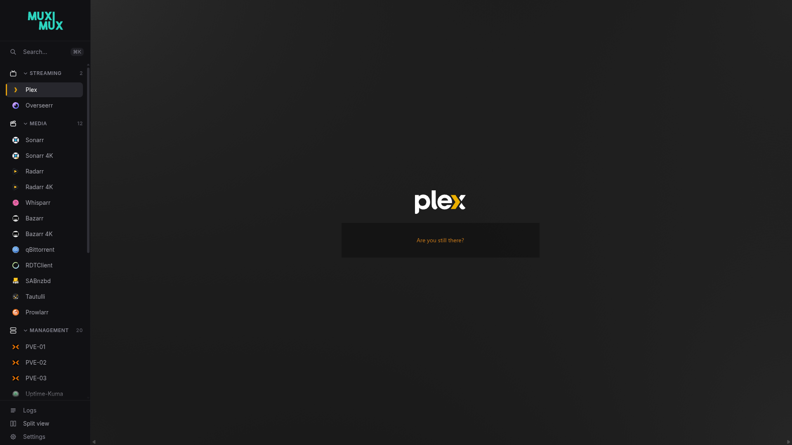
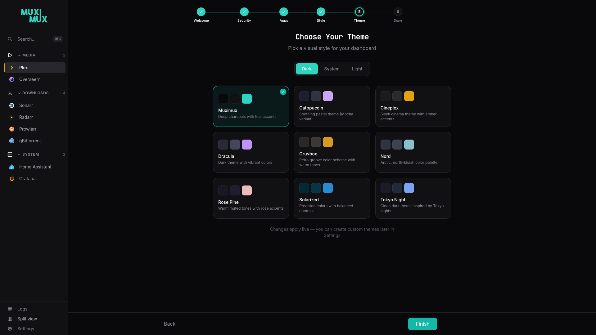
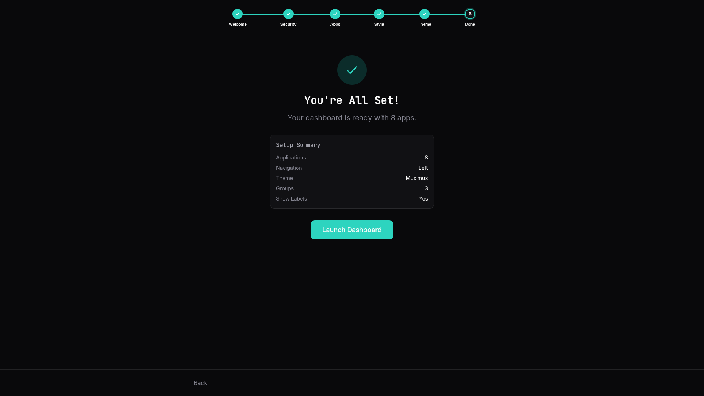

# Getting Started

This page walks you through what happens the first time you launch Muximux and how to get your dashboard up and running.

---

## First Launch

When Muximux starts with no apps configured (either no `data/config.yaml` exists or the file has an empty `apps` list), it shows the **Onboarding Wizard** -- a guided setup that walks you through initial configuration.

Open your browser and navigate to Muximux (by default, `http://your-server:8080`).

---

## Onboarding Wizard

The wizard has six steps on a first launch, including a **Security** step where you choose your authentication method. If authentication has already been configured (e.g., you deleted all apps but kept your auth settings), the Security step is skipped, making it five steps. You can move forward and backward between steps at any time.

### Step 1: Welcome

A brief introduction to Muximux and its core features: embedded app views via iframes, health monitoring, and keyboard-driven navigation. Click **Let's Get Started** to begin.



### Step 2: Security (fresh install only)

On a fresh install where no authentication has been configured, the wizard includes a Security step. Here you choose how users authenticate:

- **Password** -- Create an admin account with a username and password. This uses Muximux's built-in authentication.
- **Forward Auth** -- Use an external authentication proxy (Authelia, Authentik, etc.). You'll need to provide at least one trusted proxy CIDR range.
- **None** -- Disable authentication entirely. Anyone who can reach Muximux has full access.

This step only appears during initial setup. After setup is complete, authentication settings can be changed in Settings.

### Step 3: Apps & Groups

This step uses a two-column layout (single column on mobile):

**Left column** -- Browse popular self-hosted application templates organized by category:

- **Media** -- Plex, Jellyfin, Emby, Tautulli, Overseerr, Navidrome
- **Downloads** -- Sonarr, Radarr, Lidarr, Prowlarr, qBittorrent, SABnzbd, NZBGet, Transmission, Deluge
- **System** -- Portainer, Proxmox, Unraid, TrueNAS, Home Assistant, Pi-hole, AdGuard Home, Nginx Proxy Manager, Traefik, Grafana, Prometheus, Uptime Kuma
- **Utilities** -- Vaultwarden, Nextcloud, Photoprism, Immich, Paperless-ngx, Gitea, Code Server, Syncthing, Mealie, Bookstack

Click on any app to select it. When selected, a URL field appears so you can enter the actual address of that service in your network (e.g., change `http://localhost:32400/web` to `http://192.168.1.50:32400/web`).

At the top of the left column is the **Add Custom App** card. Click it to expand a form where you can provide a name, URL, icon (via the icon browser), color, and group. The group dropdown lists existing groups plus a "No Group" option.

**Right column** -- Shows your current selections:

- **Selected Apps** -- A live list of all selected template and custom apps, each with a remove button.
- **Groups** -- Auto-populated based on the categories of your selected apps. Each group is fully editable:
  - **Color** -- Click the color swatch to open a color picker.
  - **Icon** -- Click the icon area to open the icon browser and choose from Dashboard Icons, Lucide icons, or custom uploads.
  - **Name** -- Edit the group name inline.
  - **Delete** -- Remove a group with the X button.
  - **Add Group** -- Click "+ Add Group" to create a new group from scratch.



### Step 4: Navigation Style

Choose how the navigation bar appears in your dashboard:

| Position | Description |
|----------|-------------|
| **Top Bar** | Horizontal navigation across the top of the page |
| **Left Sidebar** | Vertical sidebar on the left side |
| **Right Sidebar** | Vertical sidebar on the right side |
| **Bottom Bar** | Horizontal navigation across the bottom of the page |
| **Floating** | Minimal floating buttons |

You can also toggle **Show App Labels** to control whether app names are displayed alongside their icons in the navigation.



### Step 5: Theme

Choose a visual theme for your dashboard:

- Use the **variant selector** (Dark / System / Light) to control whether to follow the OS preference or force a specific mode.
- Browse available **theme families** in a grid. Each card shows color swatches for background, surface, and accent colors. Click a family to select it.
- Changes apply **live** -- you can see the theme update the wizard background as you click.

Custom themes can be created later in Settings. The selected theme is saved to `config.yaml` as part of the server-side configuration.



### Step 6: Complete

A summary of your choices is displayed: number of apps, navigation position, theme family, number of groups, and label visibility. Click **Launch Dashboard** to apply the configuration and open your new dashboard.



---

## Restore from Backup

If you have an existing `config.yaml` backup (e.g. from a previous Muximux install or from the **Export Config** button in Settings), you can restore it directly from the welcome screen instead of going through the wizard.

On the welcome page, click **Restore from Backup** below the "Let's Get Started" button, then select your `.yaml` file. Muximux will validate the config, save it, and reload — skipping the entire wizard.

---

## After Onboarding

Once the wizard completes:

- Your configuration is saved to `data/config.yaml`.
- The first app in your list is automatically set as the **default app**, which loads when you open the dashboard.
- **Health monitoring** is available but off by default. Enable it per-app in Settings or in bulk via the Apps tab. When enabled, Muximux checks each app at the configured interval (default: every 30 seconds).
- The onboarding wizard will appear automatically whenever no apps are configured. Once you add apps, it will not appear again unless all apps are removed.

You can open **Settings** at any time from the navigation bar to modify apps, groups, navigation style, themes, and all other options.

---

## Resetting Muximux

To completely start fresh and see the onboarding wizard again:

1. **Stop Muximux** (or the container).
2. **Delete or rename** the `data/config.yaml` file (or the config file in your configured data directory).
3. **Start Muximux** again.

The onboarding wizard will appear automatically because no apps are configured. No browser state needs to be cleared.

---

## Quick Manual Setup

If you prefer to skip the onboarding wizard entirely, you can create a `data/config.yaml` by hand before starting Muximux. Here is a minimal example:

```yaml
server:
  listen: ":8080"
  title: "My Dashboard"

navigation:
  position: "left"
  show_labels: true

theme:
  family: "default"
  variant: "system"

health:
  enabled: true
  interval: "30s"
  timeout: "5s"

apps:
  - name: "Portainer"
    url: "http://192.168.1.10:9000"
    icon:
      type: "dashboard"
      name: "portainer"
    color: "#13BEF9"
    group: "System"
    order: 0
    enabled: true
    default: true
    open_mode: "iframe"
    proxy: false
    scale: 1

  - name: "Plex"
    url: "http://192.168.1.10:32400/web"
    icon:
      type: "dashboard"
      name: "plex"
    color: "#E5A00D"
    group: "Media"
    order: 1
    enabled: true
    default: false
    open_mode: "iframe"
    proxy: false
    scale: 1

groups:
  - name: "System"
    icon:
      type: "lucide"
      name: "server"
    color: "#F46800"
    order: 0
    expanded: true

  - name: "Media"
    icon:
      type: "lucide"
      name: "play"
    color: "#E5A00D"
    order: 1
    expanded: true
```

See the [Configuration Reference](configuration.md) for a complete description of every available option.
